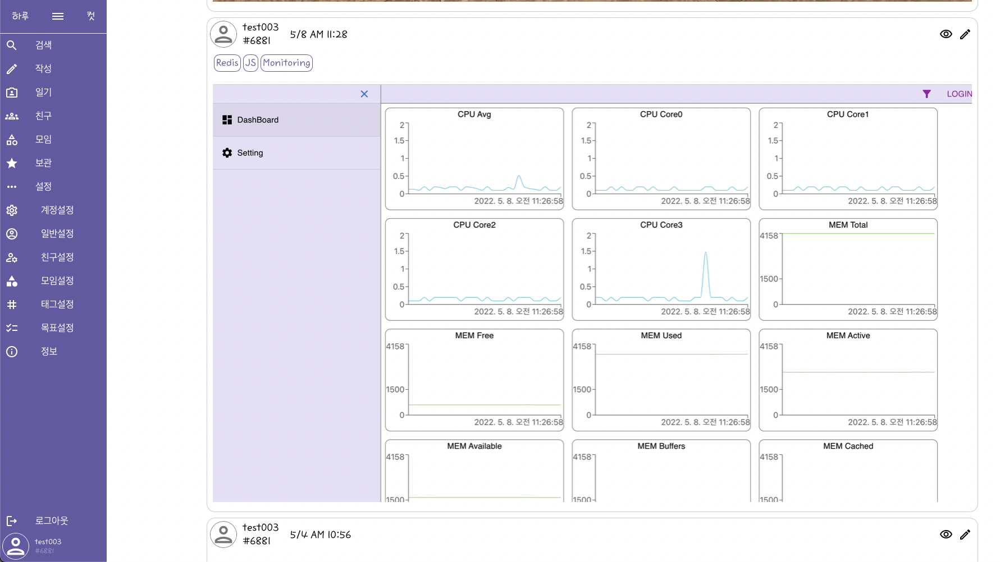

# 하루세컷 (SNS형 일기)

진행: 진행 중
태그: Back-End, FastAPI, Front-End, Mobx, MongoDB, NoSQL, Python, React.JS, TypeScript

# 하루세컷 (SNS형 일기)

## 팀 프로젝트

## 1. 개발 목표

- 매일매일 일기 쓰기 귀찮은 사람들에게 쉽고 간단한 나만의 일기 작성
- 매일매일 사소한 변화 또는 자신만의 목표 달성을 매일 기록하고 싶은 사람
- 하루에 사진 3장씩만 찍어서 일기를 작성
- 다른사람의 피드를 보고 동기부여 + 댓글 기능으로 응원, 조언하기
- PC(Width > 620px) + Mobile 페이지

---

## 2. 결과물

PC Version 내가 쓴 일기

Mobile Version 내가 쓴 일기

Mobile Version 친구의 일기

PC Version 저장한 일기

PC Version 일기 작성

로그인 API

나의 일기 API

---

## 3. 디렉토리 구조

- /src (React)
    - /atoms
        
        button.tsx
        
        chip.tsx
        
        divider.tsx
        
        input.tsx
        
        navButton.tsx
        
        NonDiary.tsx
        
        index.ts
        
    - /icons
        
        ICONS…
        
        index.ts
        
    - /interfaces
        
        atoms.interface.ts
        
        common.interface.ts
        
        diary.interface.ts
        
        friend.interface.ts
        
        layout.interface.ts
        
        login.interface.ts
        
        organisms.interface.ts
        
        register.interface.ts
        
        theme.interface.ts
        
        index.ts
        
    - /libs
        
        fetchFunction.ts
        
        imageFunction.ts
        
        stringFunction.ts
        
        timeFunction.ts
        
        windowFunction.ts
        
        index.ts
        
    - /organisms
        
        avatar.tsx
        
        checkItem.tsx
        
        friendAddContainer.tsx
        
        iconButton.tsx
        
        imageSelector.tsx
        
        post.tsx
        
        sidebarItem.tsx
        
        userInfoArea.tsx
        
        index.ts
        
    - /stores
        
        account.store.ts
        
        diary.store.ts
        
        root.store.ts
        
        theme.store.ts
        
    - /pages
        - /diary
            
            diary.container.tsx
            
            diary.tsx
            
        - /friend
            
            friend.container.tsx
            
            friend.tsx
            
        - /friendSetting
            
            friendSetting.container.tsx
            
            friendSetting.tsx
            
        - /layout
            - /desktop
                
                sidebar.desktop.container.tsx
                
                sidebar.desktop.tsx
                
            - /mobile
                
                header.mobile.container.tsx
                
                header.mobile.tsx
                
                sidebar.mobile.container.tsx
                
                sidebar.mobile.tsx
                
            
            layout.desktop.tsx
            
            layout.mobile.tsx
            
            layout.tsx
            
        - /login
            
            login.container.tsx
            
            login.desktop.tsx
            
            login.mobile.tsx
            
        - /party
            
            party.container.tsx
            
            party.tsx
            
        - /register
            
            register.container.tsx
            
            register.desktop.tsx
            
            register.mobile.tsx
            
        - /save
            
            save.container.tsx
            
            save.tsx
            
        - /setting
            
            setting.container.tsx
            
            setting.tsx
            
        - /writeDiary
            
            updateDiary.container.tsx
            
            writeDiary.container.tsx
            
            writeDiary.tsx
            
        
        index.ts
        
    
    App.tsx
    
    index.tsx
    
    router.tsx
    
- /server(FastAPI)
    - routes
        
        account.py
        
        diary.py
        
        model.py
        
    
    main.py
    
    myDB.py
    

---

## 4. DB 구조

[diary](https://www.notion.so/26b9fa8b5aeb4a849ec807677c0b54bf)

[account](https://www.notion.so/2bdc706385874f38a7e5f1c494554a5a)

---

## 5. 요약 코드

[Front-End 정리](https://www.notion.so/Front-End-b136674f358e44d6b0f9d72d0d7cdbc1)

[Back-End 정리](https://www.notion.so/Back-End-b7293b361c204c3fbe20b1c37ca3f374)